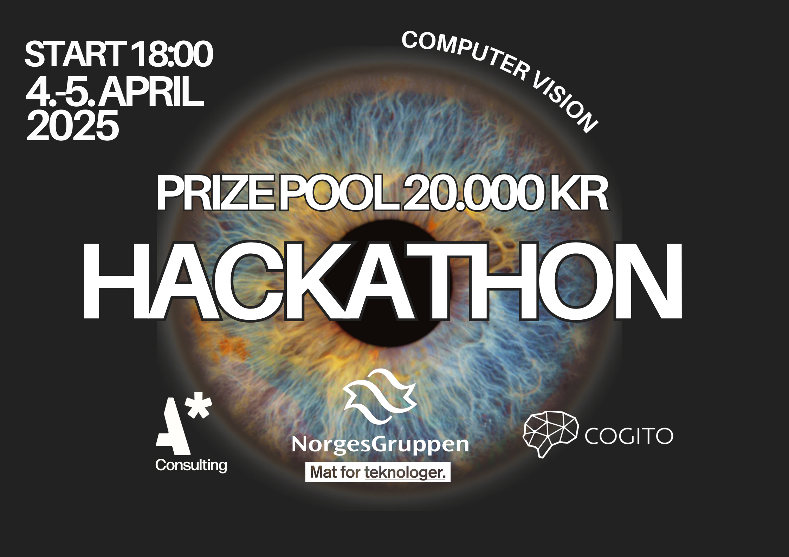

# ASTAR NGD COGITO INFORMATIONATHON 2025

## Who are we?

### [Astar Consulting](https://www.astartechnologies.no/)

Astar Consulting is a professional consulting firm affiliated allowing students to work with AI. Comprising young, talented, and sharp minds, the company specializes in generative artificial intelligence and is at the forefront of this field. They have delivered solutions that have created significant value for their clients.

### [NorgesGruppen Data](https://norgesgruppendata.no/)

NorgesGruppen Data is responsible for the daily operation of applications, servers, networks, and integrations for NorgesGruppen, Norway's largest trading house with groceries as its core business. They develop applications, apps, and services, and continually adopt new cloud services to ensure an efficient daily operation for their users.

### [Cogito NTNU](https://www.cogito-ntnu.no/)

Cogito NTNU is Norway's largest technical AI student organization, consisting of approximately 70 active members. Each semester, they offer projects that provide students with hands-on experience in artificial intelligence alongside their studies. Their goal is to promote learning and development in artificial intelligence at all levels.

## Case introduction

> Modernize the self checkout experience with computer vision

### Background

**Imagine a world** where checking out groceries is seamless, accurate, and fraud-free. At Meny Skøyen, we're building the foundation for this future with 8 cameras installed above self-checkout machines, creating a comprehensive dataset that pairs product images with their exact product numbers.

Self-checkout technology represents a **double-edged sword** for modern retail:

**The Opportunity:** Enhanced customer convenience, operational efficiency, and reduced labor costs.

**The Challenge:** **Substantial financial losses** due to fraud and errors. The situation is so severe that some international retailers have already begun removing these systems, with Norwegian merchants considering similar actions.

**The Stakes Are High:**

- NorgesGruppen operates **over 2,000 self-checkout terminals across 446 stores**
- MENY and SPAR estimate annual losses between **60 and several hundred million NOK**
- Approximately **0.5-1% of all items** pass through these systems without payment
- KIWI has deliberately limited self-checkout deployment due to these concerns

Beyond financial losses, many customers struggle with these systems, especially with **barcode-free items** like produce and bakery goods. This creates a frustrating experience and leads to both unintentional undercharging and overcharging.

To tackle these challenges head-on, MENY Skøyen has partnered with NorgesGruppen's AI lab in an innovative initiative. **All eight self-checkout stations** are now equipped with Logitech C920e cameras. The scale is impressive: approximately **11,000 daily transactions** involving more than **8,000 unique products** that need accurate identification.

**This is where you come in.** This INFORMATIONathon challenges you to leverage cutting-edge computer vision technology to revolutionize self-checkout, improving accuracy while creating a customer experience that's second to none.

## Challenge Overview

This INFORMATIONathon consists of two main problems:

1. **[Product Recognition (Problem 1)](./INFORMATION/Problem%201/description.md)** - Build a computer vision model that can accurately identify grocery products from images
2. **[Receipt Generation from Video (Problem 2)](./INFORMATION/Problem%202/description.md)** - Create a system that can produce an accurate receipt by analyzing checkout video footage

## Evaluation and Submission

- Learn about our [judging criteria and prizes](./INFORMATION/Evaluation%20and%20criteria.md)
- Follow the [submission guidelines](./INFORMATION/Submission%20information.md) to ensure your solution can be properly evaluated

## Point of contact

There will be people from Astar, NGD and Cogito at the INFORMATIONathon throughout the event.

### Astar Consulting

- **Erik Nymo Bohne**
  - 932 87 479
  - erik@astarconsulting.no
- **Mikael Steenbuch**
  - 928 83 570
  - mikael@astarconsulting.no
- **Afras Mansoor**
  - 401 66 715
  - afras@astarconsulting.no

### NorgesGruppen Data

- **Christian Rossow**
- **Andrea Holtet Bjørge**

### Cogito NTNU

- **Eduard Prokhorikhin**

  - 925 56 483

- **Kristoffer Nohr Olaisen**

  - 936 09 689

- **Maia Austigard**

  - 459 01 314

- **Mina Al-Dolaimi**
  - 980 30 420

[Link to dataset](https://drive.google.com/drive/folders/1etAauJm57AlihCFAl__i8DSuvi_wogoH?usp=drive_linkhttps://drive.google.com/drive/folders/1etAauJm57AlihCFAl__i8DSuvi_wogoH?usp=drive_link)
